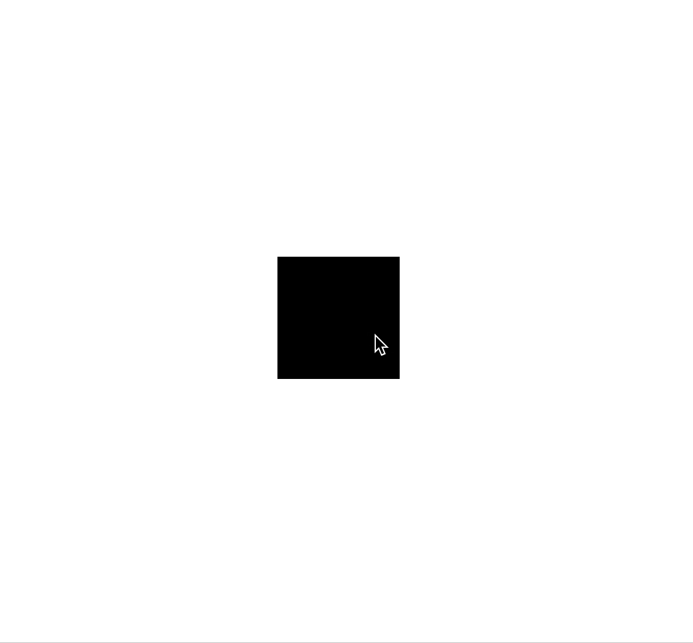

# Dynamic value

A small lib that provides custom class `DynamicValue`, subclass of `Number`. 

## Methods

- `static` `DynamicValue.tick()` - triggers calculations for all instances of `DynamicValue`
- `transitionTo(number)` - enables transition change from current value to passed.
- `reset(number?)` - resets value to initial or specified value. Doesn't start transition.
- `current()` - returns current value. Returns different values during transition.

## Usage

```javascript
import { DynamicValue } from 'dynamic-value';
import { animationFrameCycle } from './renderUtils';


let squareEl = document.getElementById('square');
let startValue = 100;
let endValue = 200;
let transitionDurationMs = 300;
let cubicBezierString = '.07,.85,.18,.99';
let scaling = false;

let dynamicValue = new DynamicValue(startValue, transitionDurationMs, cubicBezierString);

squareEl.addEventListener('click', () => {
  if (scaling) {
    dynamicValue.transitionTo(startValue);
    scaling = false;
  } else {
    dynamicValue.transitionTo(endValue);
    scaling = true;
  }
});

animationFrameCycle(() => {
  // triggers calculations for all instances of DynamicValue
  DynamicValue.tick();
  // function that reads current value of DynamicValue instance
  render();
});

function render () {
  squareEl.style.height = `${dynamicValue}px`;
  squareEl.style.width = `${dynamicValue}px`;
}
```

### Preview


## License

MIT
